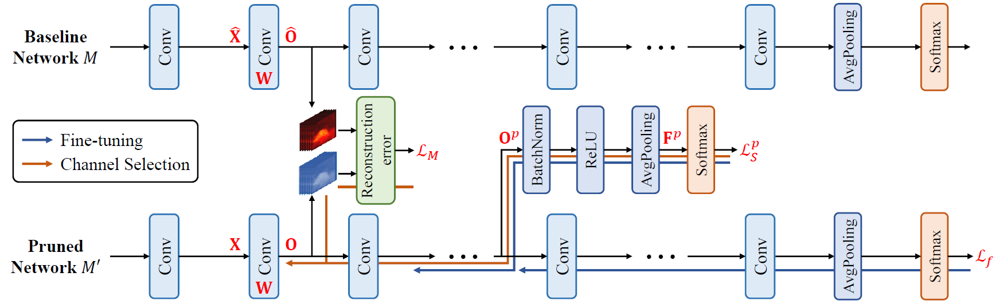

# Discrimination-aware Channel Pruning

## Introduction

Discrimination-aware channel pruning (DCP, Zhuang et al., 2018) introduces a group of additional discriminative losses into the network to be pruned, to find out which channels are really contributing to the discriminative power and should be preserved. After channel pruning, the number of input channels of each convolutional layer is reduced, so that the model becomes smaller and the inference speed can be improved.

## Algorithm Description

For a convolutional layer, we denote its input feature map as $\mathbf{X} \in \mathbb{R}^{N \times c_{i} \times h_{i} \times w_{i}}$, where $N$ is the batch size, $c_{i}$ is the number of inputs channels, and $h_{i}$ and $w_{i}$ are the spatial height and width. The convolutional kernel is denoted as $\mathbf{W} \in \mathbb{R}^{c_{o} \times c_{i} \times k \times k}$, where $c_{o}$ is the number of output channels and $k$ is the kernel size. The resulting output feature map is given by $\mathbf{Y} = f \left( \mathbf{X}; \mathbf{W} \right)$, where $f \left( \cdot \right)$ represents the convolutional operation.

The idea of channel pruning is to impose the sparsity constraint on the convolutional kernel, so that some of its input channels only contains all-zero weights and can be safely removed. For instance, if the convolutional kernel satisfies:

$$
\left\| \left\| \mathbf{W}_{:, j, :, :} \right\|_{F}^{2} \right\|_{0} = c'_{i},
$$

where $c'_{i} \lt c_{i}$, then the convolutional layer simplified to with $c'_{i}$ input channels only, and the computational complexity is reduced by a ratio of $\frac{c_{i} - c'_{i}}{c_{i}}$.

In order to reduce the performance degradation caused by channel pruning, the DCP algorithm introduces a novel channel selection algorithm by incorporating additional discrimination-aware and reconstruction loss terms, as shown below.


**Source:** Zhuang et al., *Discrimination-aware Channel Pruning for Deep Neural Networks*. NIPS '18.

The network is evenly divided into $\left( P + 1 \right)$ blocks. For each of the first $P$ blocks, an extra branch is derived from the output feature map of this block's last layer. The output feature map is then passed through batch normalization & ReLU & average pooling & softmax layers to produce predictions, from which a discrimination-aware loss is constructed, denoted as $L_{p}$. For the last block, the final loss of whole network, denoted as $L$, is used as its discrimination-aware loss. Additionally, for each layer in the channel pruned network, a reconstruction loss is introduced to force it to re-produce the corresponding output feature map in the original network. We denote the $q$-th layer's reconstruction loss as $L_{q}^{( R )}$.

Based on a pre-trained model, the DCP algorithm performs channel pruning with $\left( P + 1 \right)$ stages. During the $p$-th stage, the network is fine-tuned with the $p$-th discrimination-aware loss $L_{p}$ plus the final loss $L$. After the block-wise fine-tuning, we sequentially perform channel pruning for each convolutional layer within the block. For channel pruning, we compute each input channel's gradients *w.r.t.* the reconstruction loss $L_{q}^{( R )}$ plus the discrimination-aware loss $L_{p}$, and remove the input channel with the minimal Frobenius norm of gradients. After that, this layer is fine-tuned with the remaining input channels only to (partially) recover the discriminative power. We repeat this process until the target pruning ratio is reached.

After all convolutional layers have been pruned, the resulting network can be further fine-tuned for a few epochs to further reduce the performance loss.

## Hyper-parameters

Below is the full list of hyper-parameters used in the discrimination-aware channel pruning learner:

| Name | Description |
|:-----|:------------|
| `dcp_save_path`      | model's save path |
| `dcp_save_path_eval` | model's save path for evaluation |
| `dcp_prune_ratio`    | target pruning ratio |
| `dcp_nb_stages`      | number of channel pruning stages |
| `dcp_lrn_rate_adam`  | Adam's learning rate for block-wise & layer-wise fine-tuning |
| `dcp_nb_iters_block` | number of iterations for block-wise fine-tuning |
| `dcp_nb_iters_layer` | number of iterations for layer-wise fine-tuning |

Here, we provide detailed description (and some analysis) for above hyper-parameters:

* `dcp_save_path`: save path for model created in the training graph. The resulting checkpoint files can be used to resume training from a previous run and compute model's loss function's value and some other evaluation metrics.
* `dcp_save_path_eval`: save path for model created in the evaluation graph. The resulting checkpoint files can be used to export GraphDef & TensorFlow Lite model files.
* `dcp_prune_ratio`: target pruning ratio for input channels of each convolutional layer. The larger `dcp_prune_ratio` is, the more input channels will be pruned. If `dcp_prune_ratio` equals 0, then no input channels will be pruned and model remains the same; if `dcp_prune_ratio` equals 1, then all input channels will be pruned.
* `dcp_nb_stages`: number of channel pruning stages / number of discrimination-aware losses. The training process of DCP algorithm is divided into multiple stages. For each discrimination-aware loss, a channel pruning stage is involved to select channels within corresponding layers. The final classification loss corresponds to a pseudo channel pruning stage, which is not counted in `dcp_nb_stages`.The larger `dcp_nb_stages` is, the slower the training process will be.
* `dcp_lrn_rate_adam`: Adam's learning rate for block-wise & layer-wise fine-tuning. If `dcp_lrn_rate_adam` is too large, then the fine-tuning process may become unstable; if `dcp_lrn_rate_adam` is too small, then the fine-tuning process may take long time to converge.
* `dcp_nb_iters_block`: number of iterations for block-wise fine-tuning. This should be set to some value that the block-wise fine-tuning can almost converge and the loss function's value does not decrease much even if more iterations are used.
* `dcp_nb_iters_layer`: number of iterations for layer-wise fine-tuning. This should be set to some value that the layer-wise fine-tuning can almost converge and the loss function's value does not decrease much even if more iterations are used.

## Usage Examples

In this section, we provide some usage examples to demonstrate how to use `DisChnPrunedLearner` under different execution modes and hyper-parameter combinations:

To compress a ResNet-20 model for CIFAR-10 classification task in the local mode, use:

``` bash
# set the target pruning ratio to 0.75
./scripts/run_local.sh nets/resnet_at_cifar10_run.py \
    --learner dis-chn-pruned \
    --dcp_prune_ratio 0.75
```

To compress a ResNet-34 model for ILSVRC-12 classification task in the docker mode with 4 GPUs, use:

``` bash
# set the number of channel pruning stages to 4
./scripts/run_docker.sh nets/resnet_at_ilsvrc12_run.py -n=4 \
    --learner dis-chn-pruned \
    --resnet_size 34 \
    --dcp_nb_stages 4
```

To compress a MobileNet-v2 model for ILSVRC-12 classification task in the seven mode with 8 GPUs, use:

``` bash
# enable training with distillation loss
./scripts/run_seven.sh nets/mobilenet_at_ilsvrc12_run.py -n=8 \
    --learner dis-chn-pruned \
    --mobilenet_version 2 \
    --enbl_dst
```
