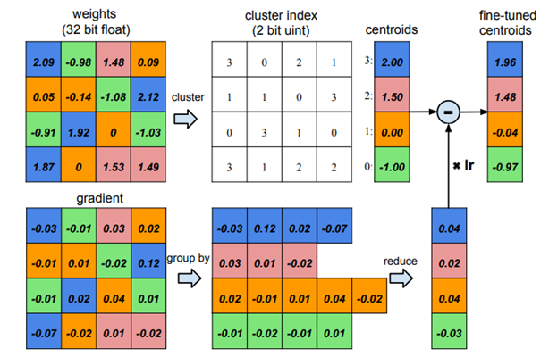

# Non-Uniform Quantization Learner
This document describes how to set up the Non-Uniform Quantization Learner in PocketFlow. In non-uniform quantization, the quantization points are not distributed evenly, and can be optimized via the back-propagation of the network gradients.
Consequently, with the same number of bits, non-uniform quantization is more expressive to approximate the original full-precision network comparing to uniform quantization.

Following a similar pattern in the previous sections, we first show how to configure the Non-Uniform Quantization Learner, followed by the algorithms used in the learner.

### Prepare the Model
Again, users should first get the model prepared. Users can either use the pre-built models in PocketFlow, or develop their custom models according to [TODO](???).

### Configure the Learner
To configure the learner, users can pass the options via the TensorFlow flag interface. The available options are as follows:

| Options      |    Default Value | Description  |
| :-------- | :--------:| :-- |
| `--nuql_opt_mode`  | weight|  variables to optimize: ['weights', 'clusters', 'both']  |
| `--nuql_init_style`  | quantile |  the initialization of quantization points: ['quantile', 'uniform']  |
| `--nuql_weight_bits`  | 4 |  the number of bits for weight  |
| `--nuql_activation_bits`  | 32 |  the number of bits for activation， by default it remains full precision   |
| `--nuql_save_quant_mode_path`  | *TODO* |  the save path for quantized models   |
| `--nuql_use_buckets`  | False |  use bucketing or not   |
| `--nuql_bucket_type`  | channel |  two bucket type available: ['split', 'channel'] |
| `--nuql_bucket_size`  | 256 |  quantize the first and last layers of the network or not  |
| `--nuql_enbl_rl_agent`  | False |  enable reinforcement learning  to learn the optimal bit allocation or not   |
| `--nuql_quantize_all_layers`  | False |  quantize the first and last layers of the network or not  |
| `--nuql_quant_epoch`  | 60 |  the number of epochs for fine-tuning  |

Note that since non-uniform quantization cannot be accelerated directly, by default we do not quantize the activations.

### Examples
Once the model is built, the Non-Uniform Quantization Learner can be easily triggered by passing the Uniform Quantization Learner in the command line as follows:
```bash
# quantize resnet-20 on CIFAR-10
# you can also configure the
sh ./scripts/run_local.sh nets/resnet_at_cifar10_run.py \
--data_disk local \
--data_dir_local ${PF_CIFAR10_LOCAL} \
--learner=non-uniform \
--nuql_weight_bits=4 \
--nuql_activation_bits=4 \

# quantize the resnet-18 on ILSVRC-12
sh ./scripts/run_local.sh nets/resnet_at_ilsvrc12_run.py \
--learner=uniform \
--data_disk local \
--data_dir_local ${PF_ILSVRC12_LOCAL} \
--nuql_weight_bits=8 \
--nuql_activation_bits=8 \
--nuql_use_buckets=True \
--nuql_bucket_type=channel
```

To enable the RL agent, one can follow similar patterns as those in the Uniform Quantization Learner:
```bash
# quantize mobilenet-v1 on ILSVRC-12
sh ./scripts/run_local.sh nets/mobilnet_at_ilsvrc12_run.py \
--data_disk local \
--data_dir_local ${PF_CIFAR10_LOCAL} \
--learner=uniform \
--nuql_enbl_rl_agent=True \
--nuql_equivalent_bits=4 \
--nuql_tune_global_steps=1200
```

### Performance
Here we list some of the performance on Cifar-10 using the Non-Uniform Quantization Learner and the built-in models in PocketFlow. The options not displayed remain the default values.


| Model |  Weight Bit|  Activation Bit  |  Acc  |
| :--------: |:--------:| :--: | :--:|
| ResNet-20  |   32  |  32   | 91.96 |
| ResNet-20  |   2 |  4 | 90.31 |
| ResNet-20  |   4 |  8 | 91.70 |


| Model |  Weight Bit|  Bucketing |  Acc  |
| :--------: | :--: |:--------:| :--: |
| ResNet-20  |  2 |  channel | 90.90 |
| ResNet-20  |  4 |  channel | 91.97 |
| ResNet-20  |  2 |  split | 90.02 |
| ResNet-20  |  4 |  split | 91.56 |


| Model |  Weight Bit|  RL search |  Acc  |
| :--------: | :--: |:--------:| :--: |
| ResNet-20  |  2 |  FALSE | 90.31 |
| ResNet-20  |  4 |  FALSE | 91.70 |
| ResNet-20  |  2 |  TRUE| 90.60 |
| ResNet-20  |  4 |  TRUE | 91.79 |

## Algorithm
Non-Uniform Quantization Learner adopts a similar training and evaluation procedure to the Uniform Quantization. In the training process, the quantized weights are forwarded. In the backward pass, the full precision weights are updated via the STE estimator. The major difference from uniform quantization is that, the location of quantization points are not evenly distributed, but can be optimized and initialized differently. In the following, we introduce the scheme to update and initialize the quantization points.

### Optimization the quantization points
Unlike uniform quantization, non-uniform quantization can optimize the location of quantization points dynamically during the training of the network, and thereon leads to less quantization loss. The location of quantization points can be updated by summing the gradients of weights that fall into the point ([Han et.al 2015](https://arxiv.org/abs/1510.00149)), i.e.,:
$$
\frac{\partial \mathcal{L}}{\partial c_k} = \sum_{i,j}\frac{\partial\mathcal{L}}{\partial w_{ij}}\frac{\partial{w_{ij}}}{\partial c_k}=\sum_{ij}\frac{\partial\mathcal{L}}{\partial{w_{ij}}}1(I_{ij}=k)
$$

The following figure taken from [Han et.al 2015](https://arxiv.org/abs/1510.00149) shows the process of updating the clusters:



### Initialization of quantization points
Aside from optimizing the quantization points, another helpful strategy is to properly initialize the quantization points according to the distribution of weights. PocketFlow currently supports two kinds of initialization: uniform initialization and quantile initialization. Comparing to uniform initialization, quantile initialization uses the quantiles of weights as the initial locations of quantization points. Quantile initialization considers the distribution of weights and can usually lead to better performance.


## References
Han S, Mao H, and Dally W J. Deep compression: Compressing deep neural networks with pruning, trained quantization and huffman coding. [arXiv:1510.00149, 2015](https://arxiv.org/abs/1510.00149)
