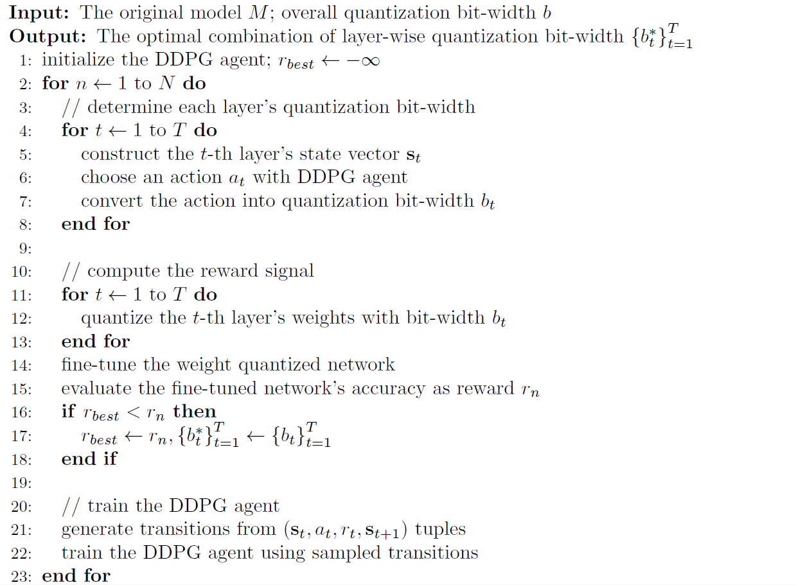

# Reinforcement Learning

For most deep learning models, the parameter redundancy differs from one layer to another.
Some layers may be more robust to model compression algorithms due to larger redundancy, while others may be more sensitive.
Therefore, it is often sub-optimal to use a unified pruning ratio or number of quantization bits for all layers, which completely omits the redundancy difference.
However, it is also time-consuming or even impractical to manually setup the optimal value of such hyper-parameter for each layer, especially for deep networks with tens or hundreds of layers.

To overcome this dilemma, in PocketFlow, we adopt reinforcement learning to automatically determine the optimal pruning ratio or number of quantization bits for each layer.
Our approach is innovated from (He et al., 2018), which automatically determines each layer's optimal pruning ratio, and generalize it to hyper-parameter optimization for more model compression methods.

In this documentation, we take `UniformQuantLearner` as an example to explain how the reinforcement learning method is used to iteratively optimize the number of quantization bits for each layer.
It is worthy mentioning that this feature is also available for `ChannelPrunedLearner`, `WeightSparseLearner`, and `NonUniformQuantLearner`.

## Algorithm Description

Here, we assume the original model to be compressed consists of $T$ layers, and denote the $t$-th layer's weight tensor as $\mathbf{W}_{t}$ and its quantization bit-width as $b_{t}$.
In order to maximally exploit the parameter redundancy of each layer, we need to find the optimal combination of layer-wise quantization bit-width that achieves the highest accuracy after compression while satisfying:

$$
\sum_{t = 1}^{T} b_{t} \left| \mathbf{W}_{t} \right| \le b \cdot \sum_{t = 1}^{T} \left| \mathbf{W}_{t} \right|
$$

where $\left| \mathbf{W}_{t} \right|$ denotes the number of parameters in the weight tensor $\mathbf{W}_{t}$ and $b$ is the whole network's target quantization bit-width.

Below, we present the overall workflow of adopting reinforcement learning, or more specifically, the DDPG algorithm (Lillicrap et al., 2016) to search for the optimal combination of layer-wise quantization bit-width:

To start with, we initialize an DDPG agent and set the best reward $r_{best}$ to negative infinity to track the optimal combination of layer-wise quantization bit-width.
The search process consists of multiple roll-outs.
In each roll-out, we sequentially traverse each layer in the network to determine its quantization bit-width.
For the $t$-th layer, we construct its state vector with following information:

* one-hot embedding of layer index
* shape of weight tensor
* number of parameters in the weight tensor
* number of quantization bits used by previous layers
* budget of quantization bits for remaining layers

Afterwards, we feed this state vector into the DDPG agent to choose an action, which is then converted into the quantization bit-width under certain constraints.
A commonly-used constraint is that with the selected quantization bit-width, the budget of quantization bits for remaining layers should be sufficient, *e.g.* ensuring the minimal quantization bit-width can be satisfied.

After obtaining all layer's quantization bit-width, we quantize each layer's weights with the corresponding quantization bit-width, and fine-tune the quantized network for a few iteration (as supported by each learner's "Fast Fine-tuning" mode).
We then evaluate the fine-tuned network' accuracy and use it as the reward signal $r_{n}$.
The reward signal is compared against the best reward discovered so far, and the optimal combination of layer-wise quantization bit-width is updated if the current reward is larger.

Finally, we generate a list of transitions from all the $\left( \mathbf{s}_{t}, a_{t}, r_{t}, \mathbf{s}_{t + 1} \right)$ tuples in the roll-out, and store them in the DDPG agent's replay buffer.
The DDPG agent is then trained with one or more mini-batches of sampled transitions, so that it can choose better actions in the following roll-outs.

After obtaining the optimal combination of layer-wise quantization bit-width, we can optionally use `UniformQuantLearner`'s "Re-training with Full Data" mode (also supported by others learners) for a complete quantization-aware training to further reduce the accuracy loss.
