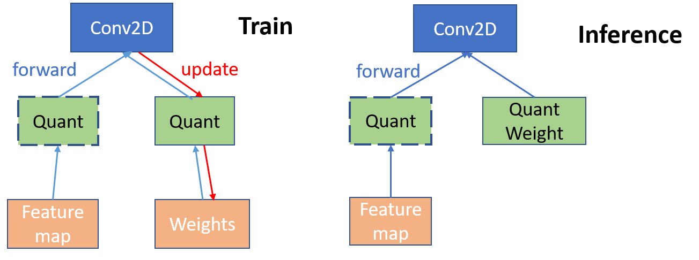

# Uniform Quantization

This document describes how to set up uniform quantization with PocketFlow. Uniform quantization is widely used for model compression and acceleration. Originally the weights in the network are represented by 32-bit float numbers. With uniform quantization, low-precision  (e.g., 4 bit, 8 bit) and evenly distributed float numbers are used to approximate the full precision networks. For 8 bit quantization, the network size can be reduced by 4 folds with little drop of performance.

 Currently PocketFlow supports two types of uniform quantization:

* Uniform Quantization Learner: the self-developed learner. Aside from uniform quantization, the learner is carefully optimized with various extensions supported. The detailed algorithm of the Uniform Quantized Learner will be introduced at the end of the algorithm. The algorithm details are presented at the end of the document.

* TensorFlow Quantization Wrapper:  a wrapper based on the [post training quantization](https://www.tensorflow.org/performance/post_training_quantization) in TensorFlow. The wrapper currently only supports 8-bit quantization, enjoying 4x reduction of memory and nearly 4x times speed up of inference.

A comparison of the two learners are shown below:

| Features|  Uniform Quantization Learner | TensorFlow Quantization Wrapper  |
| :--------: | :--------:| :--: |
| Compression |  yes  |  Yes  |
| Acceleration |    |  Yes  |
| Fine-tuning |  Yes  |    |
| Bucketing  |  Yes  |    |
| Hyper-param Searching| Yes |   |


## Uniform Quantization Learner
The uniform quantization learner supports both weight quantization and activation quantization, where users can manually set up the bits for quantization. The uniform quantization learner also supports bucketing, which leads to more fine-grained quantization and better performance. The users can also turn on the hyper parameter optimizer with reinforcement learning to search for the optimal bit allocation for the learner.

### Prepare the Model
To quantize the network, users should first get the model prepared. Users can either use the pre-built models in PocketFlow, or develop their custom models according to [TODO](???).

### Configure the Learner

To configure the learner, users can pass the options via the TensorFlow flag interface. The available options are as follows:

| Option                      | Default   | Description                                                              |
|:----------------------------|:---------:|:-------------------------------------------------------------------------|
| `--uql_weight_bits`         | 4         | Number of bits to use for quantizing weights                             |
| `--uql_activation_bits`     | 32        | Number of bits to use for quantizing activations                         |
| `--uql_use_buckets`         | False     | Use bucketing or not                                                     |
| `--uql_bucket_type`         | 'channel' | Two bucket types available: ['split', 'channel']                         |
| `--uql_bucket_size`         | 256       | Number of elements in a bucket                                           |
| `--uql_enbl_rl_agent`       | False     | Enable reinforcement learning to learn the optimal bit allocation or not |
| `--uql_quantize_all_layers` | False     | If False, leaving first and last layers unquantized                      |
| `--uql_quant_epoch`         | 60        | Number of epochs for fine-tuning                                         |

### Examples
Once the model is built, the quantization can be easily triggered by directly passing the Uniform Quantization Learner in the command line as follows:
```bash
# quantize resnet-20 on CIFAR-10
# you can also configure the
sh ./scripts/run_local.sh nets/resnet_at_cifar10_run.py \
--data_disk local \
--data_dir_local ${PF_CIFAR10_LOCAL} \
--learner=uniform \
--uql_weight_bits=4 \
--uql_activation_bits=4 \

# quantize the resnet-18 on ILSVRC-12
sh ./scripts/run_local.sh nets/resnet_at_ilsvrc12_run.py \
--learner=uniform \
--data_disk local \
--data_dir_local ${PF_ILSVRC12_LOCAL} \
--uql_weight_bits=8 \
--uql_activation_bits=8 \
--uql_use_buckets=True \
--uql_bucket_type=channel
```

### Configure the Hyper Parameter Optimizer
Once the hyper parameter optimizer is turned on, i.e., `uql_enbl_rl_agent==True` , the reinforcement learning agents will search for the optimal allocation of bits to each layers.  Before the search, users are supposed set up the bit constraints via `--uql_evquivalent_bits`, so that the optimal bits searched by the RL agent will not exceed the bit number without RL agent.
*For example, TODO*

Users can also configure other options in the RL agent, such as the number of roll-outs, the fine-tuning steps to get the reward, e.t.c.. Full list of options are listed as follows:

| Options      |    Default Value | Description  |
| :-------- | :-------:| :-- |
| `--uql_evquivalent_bits`  | 4 |  the number of re-allocated bits that is equivalent to uniform quantization without RL agent   |
| `--uql_nb_rlouts`  | 200 |  the number of roll outs for training the RL agent   |
| `--uql_w_bit_min`  | 2 |  the minimal number of bits for each layer   |
| `--uql_w_bit_max`  | 8|  the maximal number of bits for each layer  |
| `--uql_enbl_rl_global_tune`  | True |  enable fine-tuning all layers of the network or not  |
| `--uql_enbl_rl_layerwise_tune`  | False |  enable fine-tuning the network layer by layer or not |
| `--uql_tune_layerwise_steps`  | 100 |  the number of steps for layerwise fine-tuning |
| `--uql_tune_global_steps`  | 2000 | the number of steps for global fine-tuning |
| `--uql_tune_disp_steps`  | 300 |  the display steps to show the fine-tuning progress   |
| `--uql_enbl_random_layers`  | True |  randomly permute the layers during RL agent training  |

### Examples
```bash
# quantize mobilenet-v1 on ILSVRC-12
sh ./scripts/run_local.sh nets/mobilnet_at_ilsvrc12_run.py \
--data_disk local \
--data_dir_local ${PF_CIFAR10_LOCAL} \
--learner=uniform \
--uql_enbl_rl_agent=True \
--uql_equivalent_bits=4 \
--uql_tune_global_steps=1200
```

### Performance
Here we list some of the performance on Cifar-10 using the Uniform Quantization Learner and the built-in models in PocketFlow. The options not displayed remain the default values.

| Model |  Weight Bit|  Activation Bit  |  Acc  |
| :--------: |:--------:| :--: | :--:|
| ResNet-20  |   32  |  32   | 91.96 |
| ResNet-20  |   4 |  4 | 90.73 |
| ResNet-20  |   8 |  8 | 92.25 |

| Model |  Weight Bit|  Bucketing |  Acc  |
| :--------: | :--: |:--------:| :--: |
| ResNet-20  |  2 |  channel | 89.67 |
| ResNet-20  |  4 |  channel | 92.02 |
| ResNet-20  |  2 |  split | 91.15 |
| ResNet-20  |  4 |  split | 91.98 |

| Model |  Weight Bit|  RL search |  Acc  |
| :--------: | :--: |:--------:| :--: |
| ResNet-20  |  2 |  FALSE | 86.17 |
| ResNet-20  |  4 |  FALSE | 91.76 |
| ResNet-20  |  2 |  TRUE| 90.30 |
| ResNet-20  |  4 |  TRUE | 91.88 |

## TensorFlow Quantization Wrapper
PocketFlow wraps the post training quantization in Tensorflow, and include all the necessary steps to convert the model to the .tflite format, which can be deployed on Andriod devices. To run the wrapper, users only need to get the checkpoint files ready, and then run the script.

### Prepare the Checkpoint Files
Generally in TensorFlow, the checkpoints of a model include three files: .data, .index, .meta. Users are also supposed to add the input and output to collections,  and configure the wrapper to acquire the corresponding collections. An example is as follows:

*TODO* add quantization to the conversion tools
```bash
# load the checkpoints in ./models, and read the collections of 'inputs' and 'outputs'
python export_pb_tflite_models.py \
--model_dir ./models
--input_coll inputs
--output_coll outputs
--quantize True
```
If successfully transformed, the `.pb` and `.tflite` files will be saved in `./models`.

### Deploy on Mobile Devices
*TODO*


## Algorithms
Now we introduce the detailed algorithm in the Uniform Quantization Learner. As is shown in the following graph, given a full precision model, the Uniform Quantization Learner inserts quantization nodes into the computation graph of the model. To enable activation quantization, the quantization nodes shall also be inserted after the activation function.
In the training phase, both full-precision and quantized weights are stored. During the forward pass, quantized weights are obtained by applying the quantization functions on the full precision weights. For the backward propagation of gradients, since the gradients w.r.t. the quantized weights are 0 almost everywhere, we use the straight-through estimator (STE) ([Hinton et.al 2012](https://www.coursera.org/learn/neural-networks), [Bengio et.al 2013](https://arxiv.org/abs/1308.3432)) to pass the gradient of quantized weights directly to the full precision weights for update.

 

### Uniform Quantization Function
Uniform quantization distributed the quantization points evenly across the distribution of weights, and the full precision numbers are then assigned to the closest quantization point. To achieve this, we first normalize the full precision weights $x$ of one layer to  $[0, 1]$, i.e.,
$$
sc(x) = \frac{x-\beta}{\alpha},
$$
where $\alpha=\max{x}-\min{x}$ and  $\beta = \min{x}$ are the scaling factors. Then we assign $sc(x)$ to the discrete value by
$$
\hat{x}=\frac{1}{2^k-1}\mathrm{round}((2^k-1)\cdot sc(x)),
$$
and finally we do the inverse linear transformation to recover the quantized weights to the original scale,
$$
Q(x)=\alpha\hat{x}+\beta.
$$


## References
Bengio Y, Léonard N, Courville A. Estimating or propagating gradients through stochastic neurons for conditional computation. arXiv preprint [arXiv:1308.3432, 2013](https://arxiv.org/abs/1308.3432)

Geoffrey Hinton, Nitish Srivastava, Kevin Swersky, Tijmen Tieleman and Abdelrahman Mohamed. Neural Networks for Machine Learning. [Coursera, video lectures, 2012](https://www.coursera.org/learn/neural-networks)
