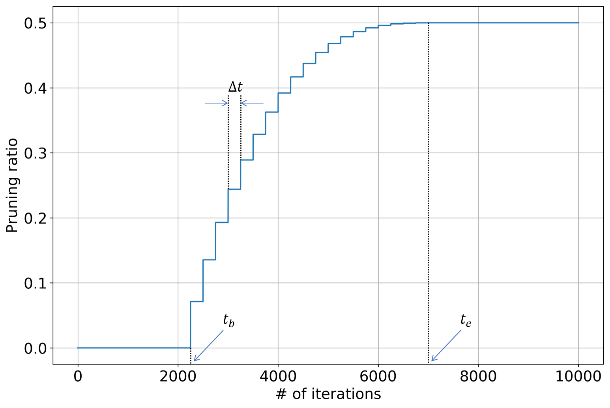

# Weight Sparsification

## Introduction

By imposing sparsity constraints on convolutional and fully-connected layers, the number of non-zero weights can be dramatically reduced, which leads to smaller model size and lower FLOPS for inference (actual acceleration depends on efficient implementation for sparse operations). Directly training a network with fixed sparsity degree may encounter some optimization difficulties and takes longer time to converge. To overcome this, Zhu & Gupta proposed a dynamic pruning schedule to gradually remove network weights to simplify the optimization process (Zhu & Gupta, 2017).

Note: in this documentation, we will use both "sparsity" and "pruning ratio" to denote the ratio of zero-valued weights over all weights.

## Algorithm Description

For each convolutional kernel (for convolutional layer) or weighting matrix (for fully-connected layer), we create a binary mask of the same size to impose the sparsity constraint. During the forward pass, the convolutional kernel (or weighting matrix) is multiplied with the binary mask, so that some weights will not participate in the computation and also will not be updated via gradients. The binary mask is computed based on absolute values of weights: weight with the smallest absolute value will be masked-out until the desired sparsity is reached.

During the training process, the sparsity is gradually increased to improve the overall optimization behavior. The dynamic pruning schedule is defined as:

$$
s_{t} = s_{f} - s_{f} \cdot \left( 1 - \frac{t - t_{b}}{t_{e} - t_{b}} \right)^{\alpha}, t \in \left[ t_{b}, t_{e} \right]
$$

where $s_{t}$ is the sparsity at iteration \#$t$, $s_{f}$ is the target sparsity, $t_{b}$ and $t_{e}$ are the iteration indices where the sparsity begins and stops increasing, and $\alpha$ is the exponent term. In the actual implementation, the binary mask is not updated at each iteration. Instead, it is updated every $\Delta t$ iterations so as to stabilize the training process. We visualize the dynamic pruning schedule in the figure below.



Most networks consist of multiple layers, and the weight redundancy may differ from one layer to another. In order to maximally exploit the weight redundancy, we incorporate a reinforcement learning controller to automatically determine the optimal sparsity (or pruning ratio) for each layer. In each roll-out, the RL agent sequentially determine the sparsity for each layer, and then the network is pruned and re-trained for a few iterations using layer-wise regression & global fine-tuning. The reward function's value is computed based on the re-trained network's accuracy (and computation efficiency), and then used update model parameters of RL agent. For more details, please refer to the documentation named "Hyper-parameter Optimizer - Reinforcement Learning".

## Hyper-parameters

Below is the full list of hyper-parameters used in the weight sparsification learner:

| Name | Description |
|:-----|:------------|
| `ws_save_path`        | model's save path |
| `ws_prune_ratio`      | target pruning ratio |
| `ws_prune_ratio_prtl` | pruning ratio protocol: 'uniform' / 'heurist' / 'optimal' |
| `ws_nb_rlouts`        | number of roll-outs for the RL agent |
| `ws_nb_rlouts_min`    | minimal number of roll-outs for the RL agent to start training |
| `ws_reward_type`      | reward type: 'single-obj' / 'multi-obj' |
| `ws_lrn_rate_rg`      | learning rate for layer-wise regression |
| `ws_nb_iters_rg`      | number of iterations for layer-wise regression |
| `ws_lrn_rate_ft`      | learning rate for global fine-tuning |
| `ws_nb_iters_ft`      | number of iterations for global fine-tuning |
| `ws_nb_iters_feval`   | number of iterations for fast evaluation |
| `ws_prune_ratio_exp`  | pruning ratio's exponent term |
| `ws_iter_ratio_beg`   | iteration ratio at which the pruning ratio begins increasing |
| `ws_iter_ratio_end`   | iteration ratio at which the pruning ratio stops increasing |
| `ws_mask_update_step` | step size for updating the pruning mask |

Here, we provide detailed description (and some analysis) for above hyper-parameters:

* `ws_save_path`: save path for model created in the training graph. The resulting checkpoint files can be used to resume training from a previous run and compute model's loss function's value and some other evaluation metrics.
* `ws_prune_ratio`: target pruning ratio for convolutional & fully-connected layers. The larger `ws_prune_ratio` is, the more weights will be pruned. If `ws_prune_ratio` equals 0, then no weights will be pruned and model remains the same; if `ws_prune_ratio` equals 1, then all weights are pruned.
* `ws_prune_ratio_prtl`: pruning ratio protocol. Possible options include: 1) uniform: all layers use the same pruning ratio; 2) heurist: the more weights in one layer, the higher pruning ratio will be; 3) optimal: each layer's pruning ratio is determined by reinforcement learning.
* `ws_nb_rlouts`: number of roll-outs for training the reinforcement learning agent. A roll-out refers to: use the RL agent to determine the pruning ratio for each layer; fine-tune the weight sparsified network; evaluate the fine-tuned network to obtain the reward value.
* `ws_nb_rlouts_min`: minimal number of roll-outs for the RL agent to start training. The RL agent requires a few roll-outs for random exploration before actual training starts. We recommend to set this to be a quarter of `ws_nb_rlouts`.
* `ws_reward_type`: reward function's type for the RL agent. Possible options include: 1) single-obj: the reward function only depends on the compressed model's accuracy (the sparsity constraint is imposed during roll-out); 2) multi-obj: the reward function depends on both the compressed model's accuracy and the actual sparsity.
* `ws_lrn_rate_rg`: learning rate for layer-wise regression.
* `ws_nb_iters_rg`: number of iterations for layer-wise regression. This should be set to some value that the layer-wise regression can almost converge and the loss function's value does not decrease much even if more iterations are used.
* `ws_lrn_rate_ft`: learning rate for global fine-tuning.
* `ws_nb_iters_ft`: number of iterations for global fine-tuning. This should be set to some value that the global fine-tuning can almost converge and the loss function's value does not decrease much even if more iterations are used.
* `ws_nb_iters_feval`: number of iterations for fast evaluation. In each roll-out, the re-trained network is evaluated on a subset of evaluation data to save time.
* `ws_prune_ratio_exp`: pruning ratio's exponent term as defined in the dynamic pruning schedule above.
* `ws_iter_ratio_beg`: iteration ratio at which the pruning ratio begins increasing. In the dynamic pruning schedule defined above, $t_{b}$ equals to the total number of training iterations multiplied with `ws_iter_ratio_beg`.
* `ws_iter_ratio_end`: iteration ratio at which the pruning ratio stops increasing. In the dynamic pruning schedule defined above, $t_{e}$ equals to the total number of training iterations multiplied with `ws_iter_ratio_end`.
* `ws_mask_update_step`: step size for updating the pruning mask. By increasing `ws_mask_update_step`, binary masks for weight pruning are less frequently updated, which will speed-up the training but the difference between pre-update and post-update sparsity will be larger.

## Usage Examples

In this section, we provide some usage examples to demonstrate how to use `WeightSparseLearner` under different execution modes and hyper-parameter combinations:

To compress a ResNet-20 model for CIFAR-10 classification task in the local mode, use:

``` bash
# set the target pruning ratio to 0.75
./scripts/run_local.sh nets/resnet_at_cifar10_run.py \
    --learner weight-sparse \
    --ws_prune_ratio 0.75
```

To compress a ResNet-34 model for ILSVRC-12 classification task in the docker mode with 4 GPUs, use:

``` bash
# set the pruning ratio protocol to "heurist"
./scripts/run_docker.sh nets/resnet_at_ilsvrc12_run.py -n=4 \
    --learner weight-sparse \
    --resnet_size 34 \
    --ws_prune_ratio_prtl heurist
```

To compress a MobileNet-v2 model for ILSVRC-12 classification task in the seven mode with 8 GPUs, use:

``` bash
# enable training with distillation loss
./scripts/run_seven.sh nets/mobilenet_at_ilsvrc12_run.py -n=8 \
    --learner weight-sparse \
    --mobilenet_version 2 \
    --enbl_dst
```
