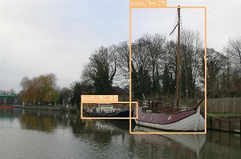

# State-of-the-art Single Shot MultiBox Detector in TensorFlow

This repository contains codes of the reimplementation of [SSD: Single Shot MultiBox Detector](https://arxiv.org/abs/1512.02325) in TensorFlow. If your goal is to reproduce the results in the original paper, please use the official [codes](https://github.com/weiliu89/caffe/tree/ssd).

There are already some TensorFlow based SSD reimplementation codes on GitHub, the main special features of this repo inlcude:

- state of the art performance(77.8%mAP) when training from VGG-16 pre-trained model (SSD300-VGG16).
- the model is trained using TensorFlow high level API [tf.estimator](https://www.tensorflow.org/api_docs/python/tf/estimator/Estimator). Although TensorFlow provides many APIs, the Estimator API is highly recommended to yield scalable, high-performance models.
- all codes were writen by pure TensorFlow ops (no numpy operation) to ensure the performance and portability.
- using ssd augmentation pipeline discribed in the original paper.
- PyTorch-like model definition using high-level [tf.layers](https://www.tensorflow.org/api_docs/python/tf/layers) API for better readability ^-^.
- high degree of modularity to ease futher development.
- using replicate\_model\_fn makes it flexible to use one or more GPUs.

***New Update(77.9%mAP): using absolute bbox coordinates instead of normalized coordinates, checkout [here](https://github.com/HiKapok/SSD.TensorFlow/tree/AbsoluteCoord).***

## ##
## Usage
- Download [Pascal VOC Dataset](https://pjreddie.com/projects/pascal-voc-dataset-mirror/) and reorganize the directory as follows:
	```
	VOCROOT/
		   |->VOC2007/
		   |    |->Annotations/
		   |    |->ImageSets/
		   |    |->...
		   |->VOC2012/
		   |    |->Annotations/
		   |    |->ImageSets/
		   |    |->...
		   |->VOC2007TEST/
		   |    |->Annotations/
		   |    |->...
	```
	VOCROOT is your path of the Pascal VOC Dataset.
- Run the following script to generate TFRecords.
	```sh
	python dataset/convert_tfrecords.py --dataset_directory=VOCROOT --output_directory=./dataset/tfrecords
	```
- Download the **pre-trained VGG-16 model (reduced-fc)** from [here](https://drive.google.com/drive/folders/184srhbt8_uvLKeWW_Yo8Mc5wTyc0lJT7) and put them into one sub-directory named 'model' (we support SaverDef.V2 by default, the V1 version is also available for sake of compatibility).
- Run the following script to start training:

	```sh
	python train_ssd.py
	```
- Run the following script for evaluation and get mAP:

	```sh
	python eval_ssd.py
	python voc_eval.py
	```
	Note: you need first modify some directory in voc_eval.py.
- Run the following script for visualization:
	```sh
	python simple_ssd_demo.py
	```

All the codes was tested under TensorFlow 1.6, Python 3.5, Ubuntu 16.04 with CUDA 8.0. If you want to run training by yourself, one decent GPU will be highly recommended. The whole training process for VOC07+12 dataset took ~120k steps in total, and each step (32 samples per-batch) took ~1s on my little workstation with single GTX1080-Ti GPU Card. If you need run training without enough GPU memory you can try half of the current batch size(e.g. 16), try to lower the learning rate and run more steps, watching the TensorBoard until convergency. BTW, the codes here had also been tested under TensorFlow 1.4 with CUDA 8.0, but some modifications to the codes are needed to enable replicate model training, take following steps if you need:

- copy all the codes of [this file](https://github.com/tensorflow/tensorflow/blob/v1.6.0/tensorflow/contrib/estimator/python/estimator/replicate_model_fn.py) to your local file named 'tf\_replicate\_model\_fn.py'
- add one more line [here](https://github.com/HiKapok/SSD.TensorFlow/blob/899e08dad48669ca0c444284977e3d7ffa1da5fe/train_ssd.py#L25) to import module 'tf\_replicate\_model\_fn'
- change 'tf.contrib.estimator' in [here](https://github.com/HiKapok/SSD.TensorFlow/blob/899e08dad48669ca0c444284977e3d7ffa1da5fe/train_ssd.py#L383) and [here](https://github.com/HiKapok/SSD.TensorFlow/blob/899e08dad48669ca0c444284977e3d7ffa1da5fe/train_ssd.py#L422) to 'tf\_replicate\_model\_fn'
- now the training process should run perfectly
- before you run 'eval_ssd.py', you should also remove [this line](https://github.com/HiKapok/SSD.TensorFlow/blob/e8296848b9f6eb585da5945d6b3ae099029ef4bf/eval_ssd.py#L369) because of the interface compatibility


***This repo is just created recently, any contribution will be welcomed.***

## Results (VOC07 Metric)

This implementation(SSD300-VGG16) yield **mAP 77.8%** on PASCAL VOC 2007 test dataset(the original performance described in the paper is 77.2%mAP), the details are as follows:

| sofa   | bird  | pottedplant | bus | diningtable | cow | bottle | horse | aeroplane | motorbike
|:-------|:-----:|:-------:|:-------:|:-------:|:-------:|:-------:|:-------:|:-------:|:-------:|
|  78.9  |  76.2 |  53.5   |   85.2  |   75.5    |  85.0 |  48.6  | 86.7  |   82.2    |   83.4   |
| **sheep**  | **train** | **boat**    | **bicycle** | **chair**    | **cat**   | **tvmonitor** | **person** | **car**  | **dog** |
|  82.4  |  87.6 |  72.7   |   83.0  |   61.3    | 88.2 |  74.5  | 79.6  |   85.3   |   86.4   |

You can download the trained model(VOC07+12 Train) from [GoogleDrive](https://drive.google.com/open?id=1yeYcfcOURcZ4DaElEn9C2xY1NymGzG5W) for further research.

For Chinese friends, you can also download both the trained model and pre-trained vgg16 weights from [BaiduYun Drive](https://pan.baidu.com/s/1kRhZd4p-N46JFpVkMgU3fg), access code: **tg64**.

Here is the training logs and some detection results:





## *Too Busy* TODO

- Adapting for CoCo Dataset
- Update version SSD-512
- Transfer to other backbone networks

## Known Issues

- Got 'TypeError: Expected binary or unicode string, got None' while training
  - Why: There maybe some inconsistent between different TensorFlow version.
  - How: If you got this error, try change the default value of checkpoint_path to './model/vgg16.ckpt' in [train_ssd.py](https://github.com/HiKapok/SSD.TensorFlow/blob/86e3fa600d8d07122e9366ae664dea8c3c87c622/train_ssd.py#L107). For more information [issue6](https://github.com/HiKapok/SSD.TensorFlow/issues/6) and [issue9](https://github.com/HiKapok/SSD.TensorFlow/issues/9).
- Nan loss during training
  - Why: This is caused by the default learning rate which is a little higher for some TensorFlow version.
  - How: I don't know the details about the different behavior between different versions. There are two workarounds:
  	- Adding warm-up: change some codes [here](https://github.com/HiKapok/SSD.TensorFlow/blob/d9cf250df81c8af29985c03d76636b2b8b19f089/train_ssd.py#L99) to the following snippet:

	```python
	tf.app.flags.DEFINE_string(
    'decay_boundaries', '2000, 80000, 100000',
    'Learning rate decay boundaries by global_step (comma-separated list).')
	tf.app.flags.DEFINE_string(
    'lr_decay_factors', '0.1, 1, 0.1, 0.01',
    'The values of learning_rate decay factor for each segment between boundaries (comma-separated list).')
	```
	- Lower the learning rate and run more steps until convergency.
- Why this re-implementation perform better than the reported performance
  - I don't know

## Citation

Use this bibtex to cite this repository:
```
@misc{kapok_ssd_2018,
  title={Single Shot MultiBox Detector in TensorFlow},
  author={Changan Wang},
  year={2018},
  publisher={Github},
  journal={GitHub repository},
  howpublished={\url{https://github.com/HiKapok/SSD.TensorFlow}},
}
```

## Discussion

Welcome to join in QQ Group(758790869) for more discussion

## ##
Apache License, Version 2.0
